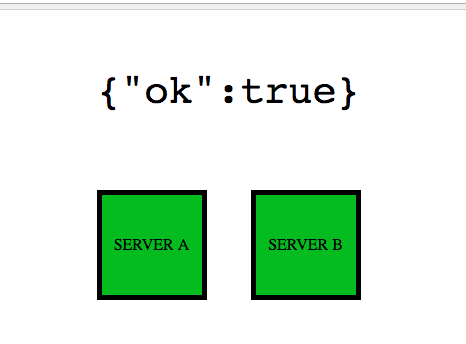
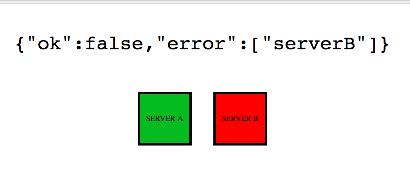
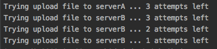

###**Task:**
Client application needs to send a binary file to the Main Server.
The Main Server, in turn, needs to send copies of this file to the Server A and to the Server B.
If the file is successfully received by both Server A and Server B, Main Server returns OK to the Client.
If an error has occurred when sending the file to Server A, Server B, or both, than the Main Server needs to return to the client the information about which server did not receive the file - Server A, Server B or both.
 
**_Messages sent by the Main Server to the Client:_**
 
The file successfully sent to Server A and Server B: 
`{ok: true}`
Error sending file to Server A: `{ok: false, error: ["ServerA"]}`

Error sending file to Server B: `{ok: false, error: ["ServerB"]}`

Error sending file to Server A and to Server B: `{ok: false, error: ["ServerA", "ServerB"]}`

_**Notes:**_ 
* To send the file from the Client to the Main Server, and to send the copies of the file from Main Server to  Server A and to Server B, node.js native HTTP module needs to be use . 
* 3-rd party modules can not be used to implement retry logic, it needs to be node.js code.
* The Client, Main Server, Server A and Server B can run on different computers.
* Addresses of Server A and Server B being passed to Main Server process in environmental variables.
* The address of the Main Server is being hard-coded in the Client.  
* All send operations are asynchronous. 
* The copies of the file should be sent to Server A and Server B in parallel.
* Server A, Server B or both can be inaccessible from the Main Server, resulting in time-outs. In this case, Main Server must retry to send the file to the Sever which is not responding, several times.
* Number of retry attempts for Server A and Server B must be configurable, and can be different for Server A and Server B. This configuration can be hardcoded in Main Server.

**_Assumptions to simplify the test:_**
 
* Main Server assumed to run without errors or timeouts.
* The only type of error that can happen when sending the file to Server A or Server B is time-out.
* Sending the file from the Client to the Main Server assumed to work without errors.
* Sending the response from the Main Server to the Client assumed to work without errors.

###**Setup and run:**
* Project _has not any external dependencies_. You just need to have NodeJS installed on your machine.

Open three terminal windows and navigate to the servers folders:
```
$ cd main-a-b/mainServer
```
```
$ cd main-a-b/serverA
```
```
$ cd main-a-b/serverB
```
Then _in each_ of terminals simply enter command:
```
$ node index.js
```
Now you have three servers running (on ports 1337, 1338 and 1339 by default).

Feel free to open `index.html` from the 'client' folder and test app in the browser.



If you would like to test how app works with inaccessible A or B server:
- Firstly stop running server (e.g. serverB) using `CTRL+C` combination in corresponding terminal window.
- Open `index.js` and replace `res.end()` with the commented line below it.
- Re-run server `$ node index.js`
- Go and test it from browser as you did it before.



> In the terminal of main server you will be able to see logs indicating about retries.

